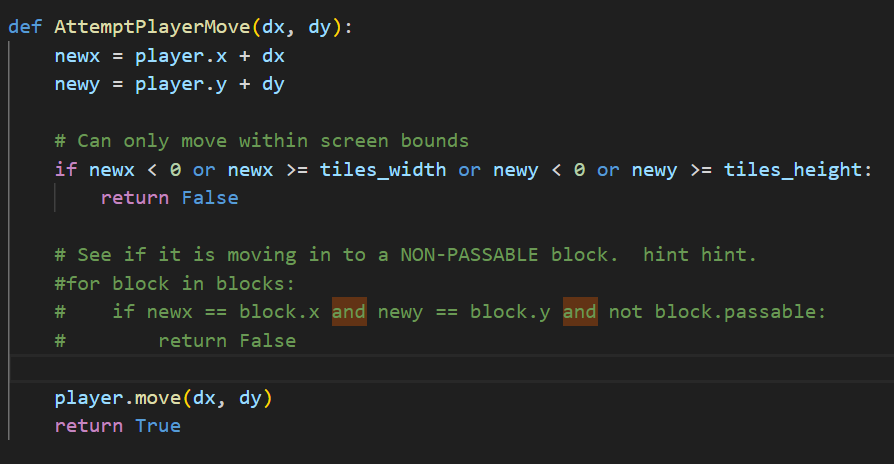
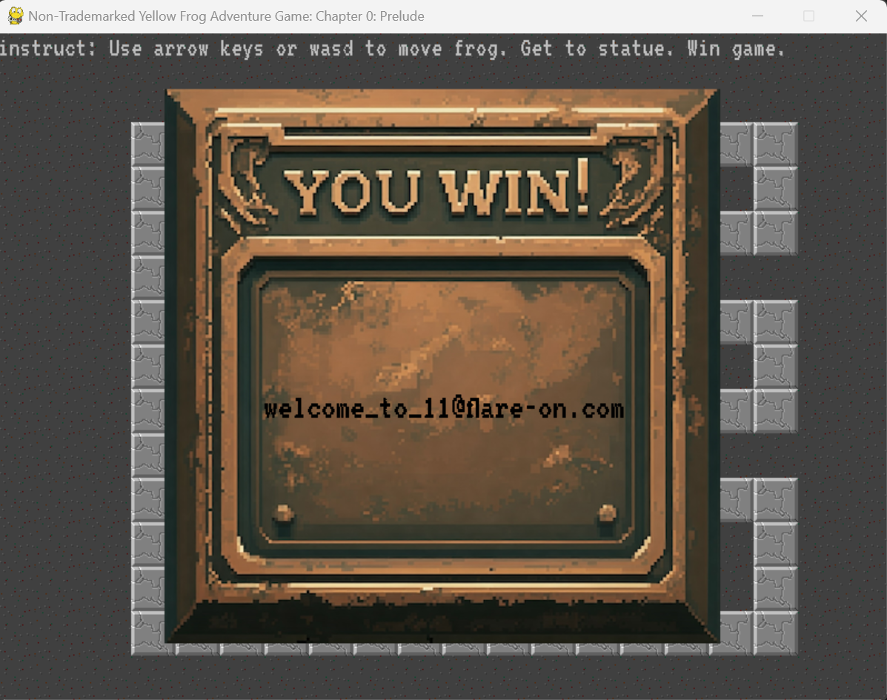
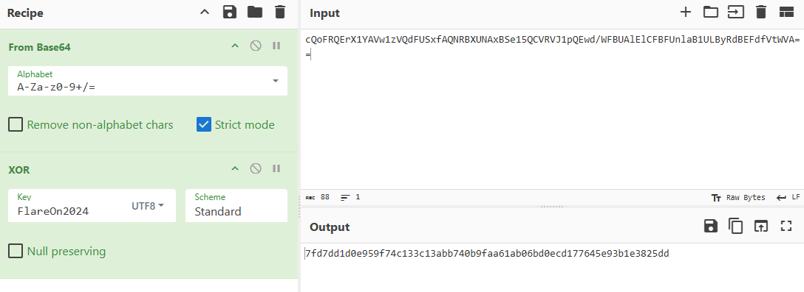
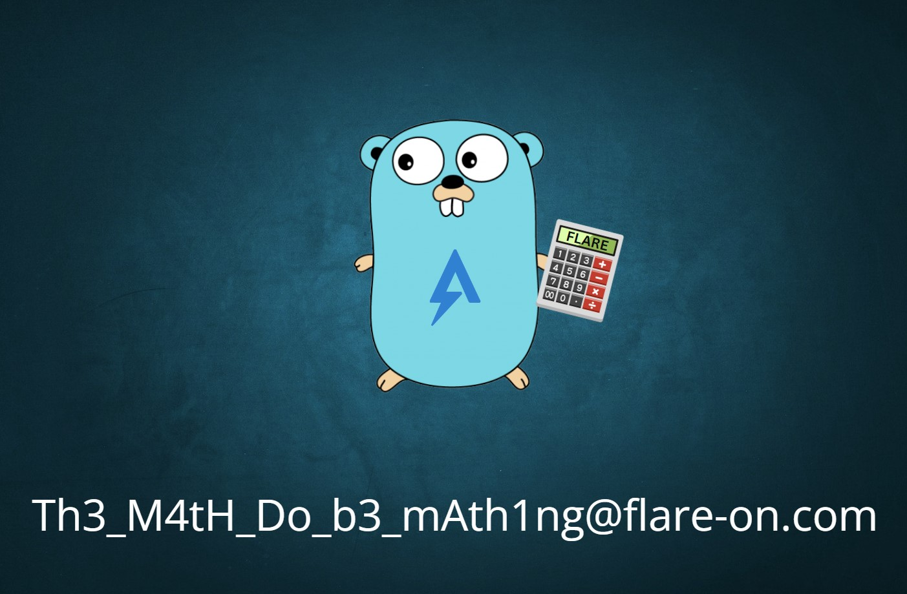
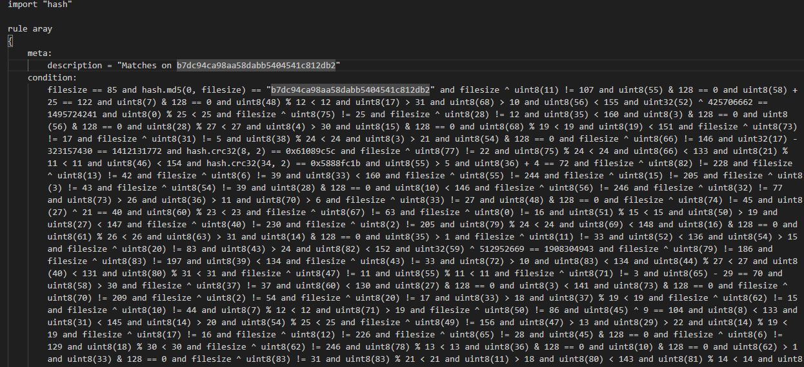
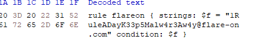
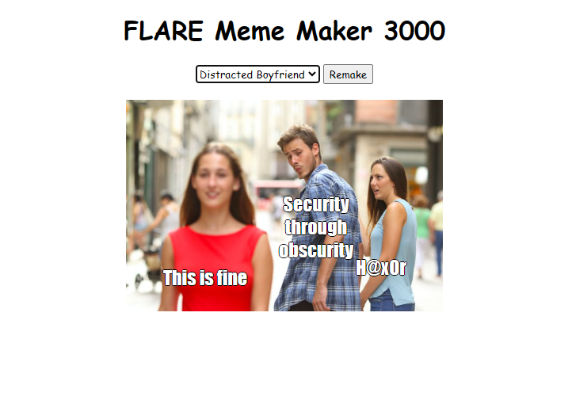

## introduction


I particited in my first flare-on challenge. 
I was only able to finish up to challenge 7 of the 10 but I will still take that as an achievement since I'm still pretty new to Reverse engineering and didnt have much time towards the end. 
definitely one of the hardest CTFs I have played but learnt a lot and had made me enjoy playing CTFs again. I really recommend those who are interested in malware analysis or reverse engineering give Flare-on a go next time!


## #1 Frog 

In the first challenge we are given a simple python game.  In this case aswell as the source code


You have to get the frog to the to center to get the flag. As you can see its completely closed off and the collision detection prevents us from getting there. 
in the Python source code I simply commented out the collision detection. Moved to the center and got the flag!😎





## #2 Checksum

We are given a Golang exe. Running the exe, it prompts a user to do a bunch of math problems (3 to 8 times) and then asks the user to input a certain checksum value, which will unlock the image (the flag).

opened it up in Ghidra and noticed an important function that is main.a. 
I had to rely mostly on the assembly code when analyzing it, as the decompiled code was a bit messed up.What main.a does is that it first XORs an input string with a constant string, ```FlareOn2024```. 
It then encodes the XOR'ed string to base64 and compares it with another string: ```cQoFRQErX1YAVw1zVQdFUSxfAQNRBXUNAxBSe15QCVRVJ1pQEwd/WFBUAlElCFBFUnlaB1ULByRdBEFdfVtWVA==```So to get the correct checksum to unlock the flag, we just have to reverse this. I just used CyberChef to do this.




Now just run the exe from the command line again, do the math problems, input the checksum value, and it should unlock an img in %LocalAppData%\REAL_FLAREON_FLAG.jpg.




## #3 ARAY 

we given a YARA rule file. we have to create a file that matches the contitions of the YARA rules



 I first thought of scripting this out. Quickly realized it would be quicker to do it manually than figuring out how to code a script for it. I ended up using notepad, a hex editor and a calculator. I would say most of the conditions are redundant so it actually didn't take that long to do all the calculations . I grouped up the ones that gave definite answers first such as ...
 ```
 uint32(10) + 383041523 == 2448764514 ,
```
there were some Hash values as well that could easily be brute forced 
```
hash.md5(0, 2) == "89484b14b36a8d5329426a3d944d2983" ```
hash.crc32(78, 2) == 0x7cab8d64
```
I opened a hex editor and starting typing in each offset and watched how the flag formed!😉




## #4 Meme maker 3000


for challenge 4 we given a obfuscated javascript file. to deobfuscated it I used an online javascript deobfuscator (https://deobfuscate.relative.im/). Made the code much easier to read.




looking through the function a0K I noticed this ***atob('Q29uZ3JhdHVsYXRpb25zISBIZXJlIHlvdSBnbzog')*** which is just a base64 encoded alert that decodes to "Congratulations! Here you go:".
This suggests that the f variable is resposible for the flag under the right conditions (a certain combination of meme and text reveals the flag).
we need specific values for four variables: a, b, c, and d.
```
At the top of the function, we see it returns early if a !== Object.keys(a0e)[5], which means a must match the value of Object.keys(a0e)[5]. This resolves to "boy_friend0.jpg".

The condition a0c.indexOf(b) == 14 tells us that b must be a0c[14], which is "FLARE On".

The condition a0c.indexOf(c) == a0c.length - 1 implies that c should be the last element in a0c, or a0c[a0c.length - 1], which is "Security Expert".

The last condition a0c.indexOf(d) == 22 specifies that d must be a0c[22], which is "Malware".
```

once these values are set we should get the flag! I set these values in the devtools console but you could also just edit the code with the values.


## #5 SSHD

This was my favourite challenge but also the hardest for me although I learnt a ton. 
I realized that the challenge was a based on the [XZ-BACKDOOR](https://www.wired.com/story/xz-backdoor-everything-you-need-to-know/) incident that happened earlier this year. 
We given a copy of a full Linux filesystem. I was abit confused at first but I got hinted by the description that I had to find stolen data (the flag!) and that it had something to do with the **SSH daemon**. 
I applied some basic digital forensics linux techniques and found this ``Flag.txt``

```
⠀⣧⠀⠀⠀⠀⠀⣿⠀⠀⠀⠀⠀⠀⠀⠀⠀⠀⠀
⠀⠀⠀⠀⠀⠀⠀⠀⠀⠀⠀⢀⣿⣧⠀⠀⠀⢰⡿⡇⠀⠀⠀⠀⠀⠀⠀⠀⠀⠀
⠀⠀⠀⠀⠀⠀⠀⠀⠀⠀⠀⢸⣿⡟⡆⠀⠀⣿⡇⢻⠀⠀⠀⠀⠀⠀⠀⠀⠀⠀
⠀⠀⠀⠀⠀⠀⠀⠀⠀⠀⠀⢸⣿⠀⣿⠀⢰⣿⡇⢸⠀⠀⠀⠀⠀⠀⠀⠀⠀⠀
⠀⠀⠀⠀⠀⠀⠀⠀⠀⠀⠀⢸⣿⡄⢸⠀⢸⣿⡇⢸⠀⠀⠀⠀⠀⠀⠀⠀⠀⠀
⠀⠀⠀⠀⠀⠀⠀⠀⠀⠀⠀⠘⣿⡇⢸⡄⠸⣿⡇⣿⠀⠀⠀⠀⠀⠀⠀⠀⠀⠀
⠀⠀⠀⠀⠀⠀⠀⠀⠀⠀⠀⠀⢿⣿⢸⡅⠀⣿⢠⡏⠀⠀⠀⠀⠀⠀⠀⠀⠀⠀
⠀⠀⠀⠀⠀⠀⠀⠀⠀⠀⠀⠀⠈⣿⣿⣥⣾⣿⣿⠀⠀⠀⠀⠀⠀⠀⠀⠀⠀⠀
⠀⠀⠀⠀⠀⠀⠀⠀⠀⠀⠀⠀⠀⣿⣿⣿⣿⣿⣿⣿⣆⠀⠀⠀⠀⠀⠀⠀⠀⠀
⠀⠀⠀⠀⠀⠀⠀⠀⠀⠀⠀⠀⢸⣿⣿⣿⡿⡿⣿⣿⡿⡅⠀⠀⠀⠀⠀⠀⠀⠀
⠀⠀⠀⠀⠀⠀⠀⠀⠀⠀⠀⠀⢸⠉⠀⠉⡙⢔⠛⣟⢋⠦⢵⠀⠀⠀⠀⠀⠀⠀
⠀⠀⠀⠀⠀⠀⠀⠀⠀⠀⠀⠀⣾⣄⠀⠀⠁⣿⣯⡥⠃⠀⢳⠀⠀⠀⠀⠀⠀⠀
⠀⠀⠀⠀⠀⠀⠀⠀⠀⠀⢀⣴⣿⡇⠀⠀⠀⠐⠠⠊⢀⠀⢸⠀⠀⠀⠀⠀⠀⠀
⠀⠀⠀⠀⠀⠀⠀⢀⣴⣿⣿⣿⡿⠀⠀⠀⠀⠀⠈⠁⠀⠀⠘⣿⣄⠀⠀⠀⠀⠀
⠀⠀⠀⠀⠀⣠⣿⣿⣿⣿⣿⡟⠀⠀⠀⠀⠀⠀⠀⠀⠀⠀⠀⠈⣿⣷⡀⠀⠀⠀
⠀⠀⠀⠀⣾⣿⣿⣿⣿⣿⠋⠀⠀⠀⠀⠀⠀⠀⠀⠀⠀⠀⠀⠀⠈⣿⣿⣧⠀⠀
⠀⠀⠀⡜⣭⠤⢍⣿⡟⠀⠀⠀⠀⠀⠀⠀⠀⠀⠀⠀⠀⠀⠀⠀⠀⢸⢛⢭⣗⠀
⠀⠀⠀⠁⠈⠀⠀⣀⠝⠀⠀⠀⠀⠀⠀⠀⠀⠀⠀⠀⠀⠀⠀⠀⠄⠠⠀⠀⠰⡅
⠀⠀⠀⢀⠀⠀⡀⠡⠀⠀⠀⠀⠀⠀⠀⠀⠀⠀⠀⠀⠀⠀⠀⠀⠀⠁⠔⠠⡕⠀
⠀⠀⠀⠀⣿⣷⣶⠒⠁⠀⠀⠀⠀⠀⠀⠀⠀⠀⠀⠀⠀⠀⠀⠀⠀⢰⠀⠀⠀⠀
⠀⠀⠀⠀⠘⣿⣿⡇⠀⠀⠀⠀⠀⠀⠀⠀⠀⠀⠀⠀⠀⠀⠀⠀⠰⠀⠀⠀⠀⠀
⠀⠀⠀⠀⠀⠈⢿⣿⣦⠀⠀⠀⠀⠀⠀⠀⠀⠀⠀⠀⠀⠀⢠⠊⠉⢆⠀⠀⠀⠀
⠀⢀⠤⠀⠀⢤⣤⣽⣿⣿⣦⣀⢀⡠⢤⡤⠄⠀⠒⠀⠁⠀⠀⠀⢘⠔⠀⠀⠀⠀
⠀⠀⠀⡐⠈⠁⠈⠛⣛⠿⠟⠑⠈⠀⠀⠀⠀⠀⠀⠀⠀⠀⠀⠀⠀⠀⠀⠀⠀⠀
⠀⠀⠉⠑⠒⠀⠁⠀⠀⠀⠀⠀⠀⠀⠀⠀⠀⠀⠀⠀⠀⠀⠀⠀⠀⠀⠀⠀⠀
if only it were that easy......

```
If only,lol😂. later I found a **SSHD core dump** file that I thought I need to analzye since it matches the title. 
The coredump file would be really useful in figureing out what caused the crash in the server as it has everything in memory at the time of the crash. 
I opened the coredump in gdb for debugging and found out that a segfault in the coredump was caused by ``/lib/x86_64-linux-gnu/liblzma.so.5``.

I decided to open the liblzma library file in Ghidra and quickly noticed a file that definitely looked like a backdoor. Essentially, what this function does is when ``RSA_public_decrypt gets called`` in ``Opensshd`` it hooks it with its own malicious function.


Analyzing it more, the function uses a ChaCha20 encryption algorithm to decrypt the encrypted shellcode. In order to tell what shellcode does, we need to decrypt it with the key and nonce. The key and nonce can be found in the coredump.


Looking at the function again and looking at the assembly code, we can see the key and nonce should be after this value ``-985630136``  in the coredump. Convert this value to hex ``0xC5407A48``. This is the value we should now look in the coredump(mapped in the coredump).It reads the key (32 bytes) from the 4th offset and the nonce (12 bytes) from the 24th offset.
So all we can do is copy these values from the coredump. 


I used a hex editor for this. Then I copied the encrypted shellcode. 
In Ghidra you can do this by ``highlighting > right-clicking >copy_special>byte_string`` and it should be in your clipboard. 
Then I just use CyberChef to decrypt the shellcode with the ChaCha20 algorithm.


loaded the shellcode in Ghidra to reverse it. I noticed a bunch of syscalls, of course. In Ghidra there is a built-in script that can resolve all syscalls.
**ResolveX86orX64LinuxSyscallsScript** that made the shellcode much easier to read.


The decompiled code isn't 100% correct, but basically what the shellcode does is:

* Establish a remote connection to the attacker's C2 server.
* receives a key by reading 32 bytes
* receives a nonce by reading 12 bytes
* receives a filename
* opens the file and reads it
* strengthens it
* encrypts it with ChaCha20
* Send it back to the attacker's C2 server.


So to decrypt the data, I would first need to find the key, the nonce, and the encrypted data, which would, of course, be in the coredump file.
Looking through the strings of the coredump, I found the filename that was used by the attacker. 
This was a bit of a guess, but it definitely made sense in this case. Now I can find the key and nonce based around the filename offsets.
We know the key and nonce are before the filename, so we just dump 32 bytes (key) and 12 bytes (nonce) from the filename offset. I used gdb for this.


Now this last part, when trying to decrypt it, really annoyed me, as I first thought the shellcode used a normal ChaCha20 algorithm, but no, I was wrong.
I ditched figuring out how the encryption works and decided to just patch the shellcode's IP address to run locally with a simple Python server.
I did find out however after I solved the challenge that the constant used in the initialization part of the ChaCha20 algorithm, which is ``expand 32-byte K``, used an upper case ``K`` instead of a lower case ``k``, which is usually used in ChaCha20😭😭🧐.


patched the attackers ip address(10.0.2.15:1337) in Ghidra to localhost which is ``0x7f000001`` in hex.

To make the shellcode executable I used this [tool](https://github.com/Njord0/ElfWizard) which made the proccess farely easy. Its basically just a shellcode loader.

then just consulted chatgpt to make me a quick python server to work with the shellcode.I had to change up a few lines but got it working eventually.
now just run the server listening or localhost and the shellcode in sudo and....... FLAG! recived 😎


## #6 Bloke2


For this challenge we given a verilog project that supposed to involve a reimplemeting of the BLAKE2 hash function. 
verilog is a hardware langauge which is something im not familar with at all but the readme included in the folder and chatgpt lol helped alot in understanding how to approach the challange.

**Note** with this challenge it was very confusing at first to me and
There was alot of messing around. the solution turned out to be a very simple, it was a single line of code change to reveal the flag.

while messying around I was looking in the **data_mgr.v** file and found something that stuck out to me.

```localparam TEST_VAL = 512'h3c9cf0addf2e45ef548b011f736cc99144bdfee0d69df4090c8a39c520e18ec3bdc1277aad1706f756affca41178dac066e4beb8ab7dd2d1402c4d624aaabe40;```

this is a 512 bit hex value which I thought must contain the flag! this value gets used later in what seems to be a loop.

```
	always @(posedge clk) begin
		if (rst) begin 
			out_cnt <= 0;
		end else begin
			//$display("%t dmgr dout oc %h", $time, out_cnt);
			if (h_rdy) begin
				//$display("%t dmgr dout h %h t %b", $time, h_in, tst);
				out_cnt <= W;
				h <= h_in ^ (TEST_VAL & {(W*16){tst}});
			end else if(out_cnt != 0) begin
				//$display("%t dmgr dout d %h dv %b de %b oc %h", $time, data_out, dv_out, data_end, out_cnt);
				out_cnt <= out_cnt - 1;
				h <= {8'b0, h[W*8-1:8]};
```


Let’s break down the code. The value TEST_VAL is combined with a modified variable tst using a bitwise AND. From the definition, tst is a reg tst, so it’s a single-bit value by default. This setup means:

```
If tst is 0, the line simplifies to h <= h_in.
   If tst is 1, it changes to h <= h_in ^ TEST_VAL.
```
The challenge description suggests that the solution involves the “testbenches,” which likely means tst should be 1. we can now just modify the code so that it always executes as ```h <= h_in ^ TEST_VAL```.

running the makefile after the change....gets the flag!


