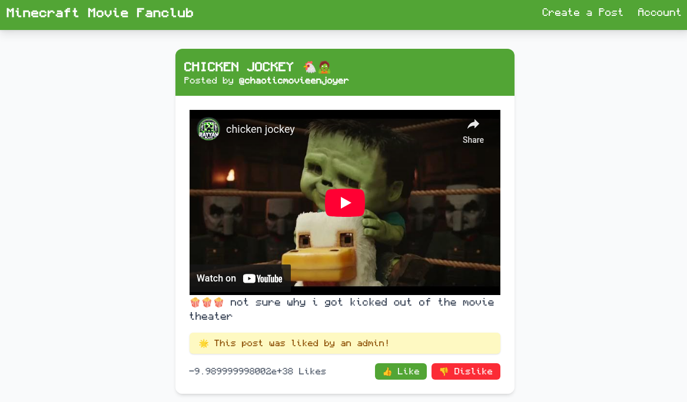
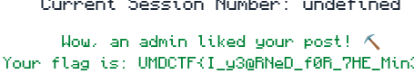

# UMDCTF Minecraft movie web Challenge Writeup

##  Introduction
This past weekend I played UDMCTF with RaptX and played 38th! In this post I will go over a fun client-side web challenge where the intended solution involved using Dom clobbering although one of my teammates came up with another rather clever unintended solution that I will go over as well.
##  Reconnaissance

### Initial Observations
- **Two URLs Provided**:
  - A Minecraft fanclub website where users could post and react to content.
  - Admin bot that only accepted post IDs (likely for XSS/CSRF exploitation).
  - application uses latest dompurify but allows iframe tags and theres is a check to only allow youtube to be embedded.



 - **Session Quirk**:
    - Dashboard initially showed: `Current Session Number: undefined` ( could help us with dom clobbering )
    - After liking posts: Updated to numerical value

- **Admin Behavior Hint**:
  - One post contained: `🌟 This post was liked by an admin!`
  - Main objective: Make admin "like" our post
  
- **HTML Injection**:
- we can inject html when creating a post . I tested this with b tags
  ```html
  Test post with <b>HTML</b> tags <!-- Rendered properly -->
  <script>alert(1)</script> <!-- Blocked -->

  

###  Vulnerability Discovery

If we like someone else’s post and return to our dashboard, the “session number” updates to show how many likes we’ve given. Checking the network requests, we see it hits a legacy endpoint called `/legacy-social`.

When liking a post, the request includes the `sessionNumber` from the window object:
`window.sessionNumber`
Originally, this was `undefined`, just like the dashboard showed. We suspect it’s a global JavaScript variable. Testing this in the console confirms that `window.sessionNumber` is accessible and matches the dashboard number.

Also, in the HTML source of a post, we notice this comment:

`<!-- TODO: Migrate social endpoint, switch to useState/useContext -->`

This tells us the site is poorly managing state and relying on global JavaScript objects like `window.sessionNumber`.

###  Exploitation (intended solution)

####  DOM Clobbering

**DOM clobbering** lets us overwrite JavaScript variables by injecting elements with certain `id` attributes. Since `sessionNumber` is a global variable, we can try to overwrite it via HTML.

Here’s the key code from the like/dislike function:
``if (window.sessionNumber === undefined) {   setSocialError("Session not started. Cannot like/dislike.");   return; }``

And here’s the request payload it sends:

`sessionNumber=<value>&postId=<id>&likes=<value>`

So, we craft a post with this injected content:

`<a href="&likes=10" id="sessionNumber">gimme dat like</a>`

Here’s what happens:

- The anchor tag sets its `id` to `sessionNumber`.
    
- This **overwrites** `window.sessionNumber` with a reference to the element.
    
- The browser reads the `href` attribute when converting `window.sessionNumber` to a string (in the `fetch()` body).
    
- Because the `href` starts with `&`, it **inserts a new query param** into the payload.
    

Even though the admin will click the “dislike” button, our manipulated request ends up sending `likes=10`, tricking the backend into **liking** the post instead.

Once the admin processes our crafted post, we return to our account overview and see the result: 




## Unintended solution

My teammate found a clever alternative solution involving a CSRF attack . the application allows you to only embed content from youtube.

``` html
const dirtyHTML = f.content;`
`const cleanHTML = DOMPurify.sanitize(dirtyHTML, {`
  `ADD_TAGS: ["iframe"],`
  `ADD_ATTR: ["allow", "allowfullscreen", "frameborder", "scrolling", "src", "width", "height"]`
`});`

`...`

`DOMPurify.addHook("uponSanitizeElement", (node, data) => {`
  `if (data.tagName === "iframe" && node instanceof Element) {`
    `const src = node.getAttribute("src") || "";`
    `if (!src.startsWith("https://www.youtube.com/embed/")) {`
      `node.parentNode.removeChild(node);`
    `}`
  `}`
`});
```
my teammate found out that youtube has a known openredirect vulnerability that could be chain with other google openredirect vulnerability to redirect the admin bot to an attacker side to perfom a CSRF attack :  ```
<iframe src="https://www.youtube.com/embed/../logout?continue=https://googleads.g.doubleclick.net/pcs/click?adurl=<your-own-website>"></iframe>```

In our site we could use html like this for the CSRF attack:```
```
<script>
fetch('https://a-minecraft-movie-api.challs.umdctf.io/legacy-social', {
  method: 'POST',
  headers: {
    'Content-Type': 'application/x-www-form-urlencoded',
  },
  body: 'sessionNumber=1&postId=<post-id>&likes=1',
  credentials: 'include'
});
</script>
```  
The reason why this also worked was because the application cookies was set to `sameSite=none`