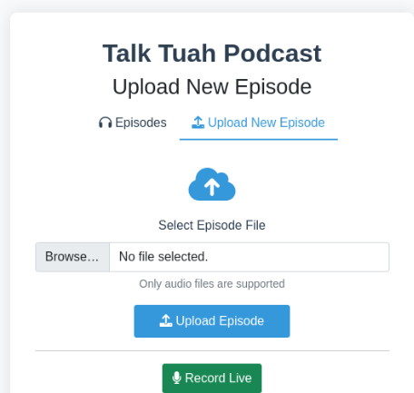
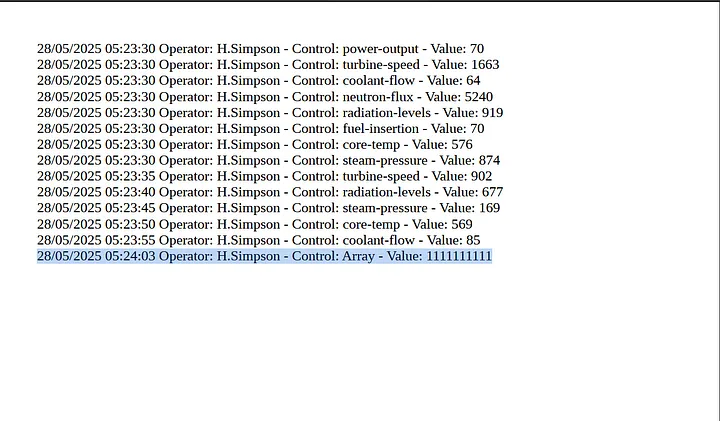
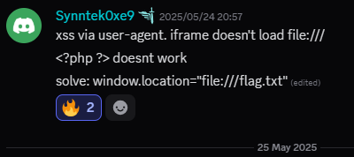
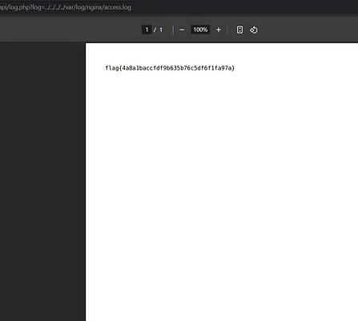

Over the weekend I played NahamCon-CTF with Raptx and placed 15th! out of 6748 teams! I primarily focused on the web challenges. The web challs featured mostly blackbox styled which aren't my favorite but still enjoyed them overall.
I will be going over 2 challs that I found the most interesting  ;)

## TALK TUAH

this challenge startled us for a bit we ended up not solving it in the end but my idea to solve it ended up being one of the 2 solutions to the challenge. I left the challenge for last 2 hours and was having problems with my script and also should've used Burpsuite instead!

Talk tuah was a simple flask based web application that implements ffmpeg and allows a user to upload a mp3 file; view it and can choose to delete it. We were also given the source code of the application for 
analysis 



Upon viewing the source code, we can see from the **Dockerfile** that the flag is stored in /app/flag.txt . There's no obvious way the flag can be retrieved from looking at the source code so the objective of the CTF has to be get Remote code execute(RCE) or from a file read vulnerability somehow.

One way I thought immediately to get RCE was through SSTI since the application is written in flask and flask uses Jinja2 templating engine. Although the application isn't directly vulnerable to SSTI. I remembered from playing [alpaca solo ctf](https://naup.mygo.tw/2025/05/30/alpacahack-round-11-web-writeup/#Tiny-Note) where the challenge solution was to overwrite template files so that it can be vulnerable to SSTI. This is the approach I took to try solving the challenge. although the challenge didn't have an obvious file write vulnerability. I was struggling for a while to figure out if it was possible until I realized I should always take into account RACE CONDITIONS when looking for arbitrary file overwrites. 


 ## Potential path traversal 
The application accepts MP3 uploads and sanitizes the "tags" and write it to `/static/episode_metadata/"episodes_name"`. If we inject a path transveral ../ in the mp3 metadata we could get arbitrary file write! This isn't so easy though because the application validates `episode_name` with `episode_name.isalnum()`which is a alphanumeric function checker, before extracting it. 

```python
def is_valid_mp3(filepath):
    try:
        [...]
        episode_name = tags.get('episode_name', '')
        if episode_name != '' and not episode_name.isalnum():
            # Incompatible MP3 metadata found
            return False

        [...]
    except Exception as e:
        return False
```
 Could there be a way to bypass this check? Yes! within that process there is a race condition that we can use to get arbitrary file overwrite.

## Race condition with file upload
If you look below our requests file is written before calling the ```is_valid_mp3``` function. so if we could send one file `episode_name`  that actually gets validated and then send a malicious one with our payload at the exact same time and continuously one of our requests should win the race window and successfully overwrite uploads.html to get SSTI. we could also make the valid mp3 file a much larger size size so that we can have a bigger race window and have a higher chance of getting the malicious file through.

```python
@app.route('/', methods=['GET', 'POST'])
def upload_file():
    if request.method == 'POST':
        [...]
        filename = secure_filename(file.filename)
        [...]
        filepath = os.path.join(app.config['EPISODE_FOLDER'], filename)
        file.save(filepath)
        [...]
        if not is_valid_mp3(filepath):
            [...]
        try:
            probe = subprocess.run([
                "ffprobe", "-v", "quiet", "-print_format", "json", "-show_format", filepath
            ], capture_output=True, text=True)
            [...]
        except Exception as e:
            [...]

        subprocess.run(["ffmpeg", "-i", filepath, "-f", "ffmetadata", "-y", target_path])
        [...]
```


 ## exploitation
this ffmpeg command can be used to make a malicious mp3 file with our payload 
```bash
ffmpeg -f lavfi -i anullsrc=r=44100:cl=mono -t 5 -metadata episode_name="../../templates/upload.html" -metadata title="{{request.application.__globals__.__builtins__.__import__('os').popen('cat flag.txt').read()}}" -c:a libmp3lame traversal.mp3
```

now we can make a dummy mp3 file that will get validated and send both files at the same time continuously and we should get the flag from the SSTI! 


# Access All Areas
  

## Introduction

In this post I will explain how we leverage an XSS and a Nginx access log path traversal to get the flag.
this was a blackbox styled web challenge that was build with : ```php, nginx web server and headless chrome pdf generator```
The application was basically a nuclear factory controller panel and can generate a pdf that shows the factory's facilities logs. 


### Nginx access logs path traversal
while doing enumeration of the application It was clear that the goal was to get a Remote code execution or discover a path traversal vulnerability to get the flag. 
Since the application was using Nginx its common practice from playing other ctfs to lookout for access to Nginx access logs. 
I discovered that the path that directs us to the pdf can be tampered with :`GET /api/log.php?log=` . I tried a directory traversal payload `GET /api/log.php?log=../../../../var/log/nginx/access.log` and it worked! The application doesn't sanitize user input in that parameter. This doesn't help us directly get the flag. 
I thought maybe if we can trick the backend to serve us other directories through the pdf with an XSS, we could get the flag

### Getting XSS
When I first noticed the pdf generator I started thinking of ways to get XSS or SSRF to get the flag from the backend. 
while playing with the requests in burpsuite I found out that you could change the value of the key from the json data that was used to print out the log data.
I thought about maybe trying to get XSS, command injection or prototype pollution here through changing the value but quickly stopped after trying all kinds of payloads. The value only allowed you to change it to integers. I started trying different parameters and Http headers that would allow us to get XSS but was struggling to get any payloads to work until my teammate found a way! 



there was an XSS vulnerability my teammate found through the user agent Http header



### Exploitation

Now we that we have everything to get the flag this was the exploitation process :

1. pollute nginx access log by sending the XSS payload first. once the XSS payload executes it will change the url to `file:///flag.txt`to get local file access to the flag and print it on the pdf.

``GET /doesntexist HTTP/1.1 Host: challenge.nahamcon.com:31210 User-Agent: <script>window.location=`file:///flag.txt`</script>``

2. read the flag file via pdf rendering (`/api/log.php?log=/../../../../../../../../var/log/nginx/access.log`)



